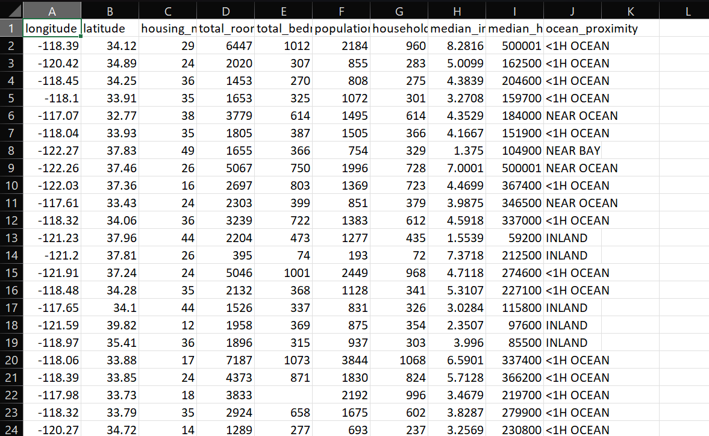
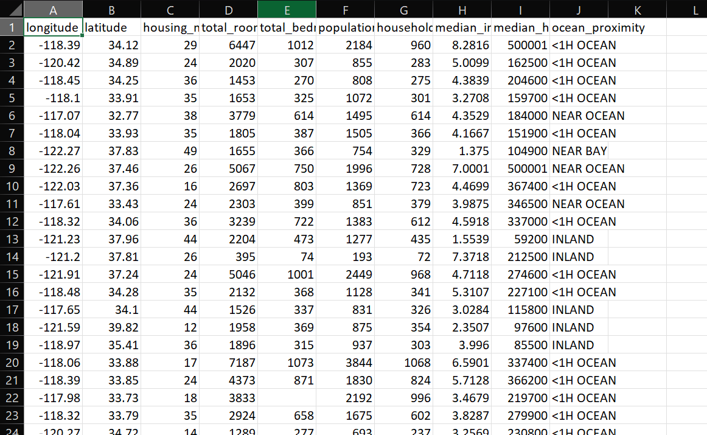

# 🏡 California Housing Price Prediction

This project demonstrates a **machine learning pipeline** for predicting California housing prices using the **California Housing dataset**.  
It includes **data preprocessing, model training, evaluation, and inference** using `scikit-learn`.

---

DATASET - (https://www.kaggle.com/datasets/camnugent/california-housing-prices)

---

## 📂 Project Files

- **main.py** → Data preprocessing pipeline (handling missing values, scaling, encoding)  
- **main2.py** → Model training with Linear Regression, Decision Tree, and Random Forest + cross-validation  
- **main3.py** → Full training & inference pipeline (saves trained model, pipeline, and generates predictions)  
- **housing.csv** → Input dataset (not included in repo, needs to be added by user)  
- **model.pkl / pipeline.pkl** → Saved trained model and preprocessing pipeline (auto-generated)  
- **input.csv / output.csv** → Sample test data and predictions (auto-generated)  
- **ccefd5f8-9667-48d1-9336-025dfa6db1f4.png** → Supporting image (optional visualization/demo)

---

## ⚙️ Tech Stack

- Python  
- Pandas / NumPy  
- scikit-learn (Pipelines, Transformers, Models)  
- Joblib (model persistence)  

---

## SCREENSHOTS

- This screenshot shows the orginal pricing of the houses

- This screenshot shows the predicted pricing of the houses showing the fantastic accuracy

